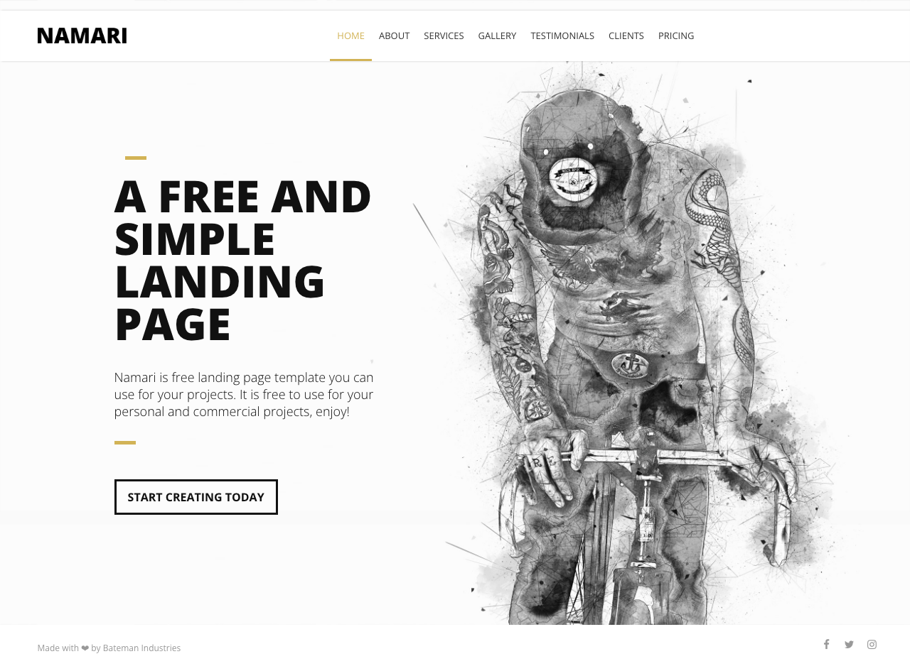

# 🚀 Relatório de Validação Runtime

**Data:** 13/10/2025, 11:33:31
**Projeto:** /Users/kalebeandrade/Dev/geral/template-exemplo-hackathon
**URL Testada:** http://localhost:4200
**Status:** ✅ PASSOU

---

## 📊 Resumo Executivo

| Métrica | Resultado |
|---------|-----------|
| **Build** | ✅ Sucesso |
| **Servidor** | ✅ Iniciado |
| **Página Carregou** | ✅ Sim |
| **Interações** | ✅ Funcionando |
| **Erros Críticos** | 0 |
| **Erros Não-Críticos** | 0 |
| **Avisos** | 0 |

---

✅ Nenhum erro crítico encontrado!

---

## 📸 Screenshot

---

## 🔍 Análise

### ✅ Validação Bem-Sucedida

O projeto está funcional após as correções de acessibilidade:
- ✅ Build compilou sem erros
- ✅ Página carrega corretamente
- ✅ Interações básicas funcionam
- ✅ Nenhum erro crítico de JavaScript

**Recomendação:** Seguro para criar Pull Request.

---

## 📋 Próximos Passos

1. ✅ Revisar relatório de acessibilidade
2. ✅ Criar Pull Request
3. ✅ Aguardar revisão de código

---

*Relatório gerado automaticamente por [Codex Morpheus](https://github.com/codex-morpheus) - Runtime Validator*
*Timestamp: 2025-10-13T14:33:31.233Z*
